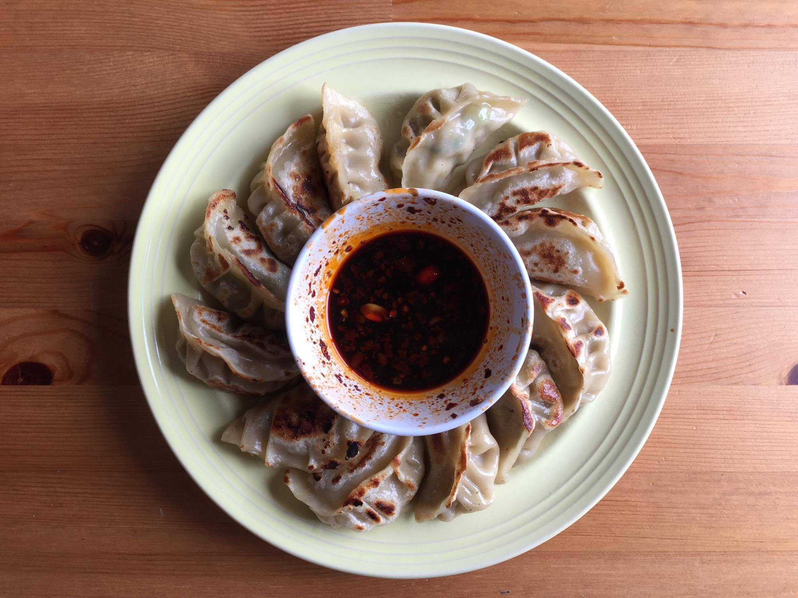
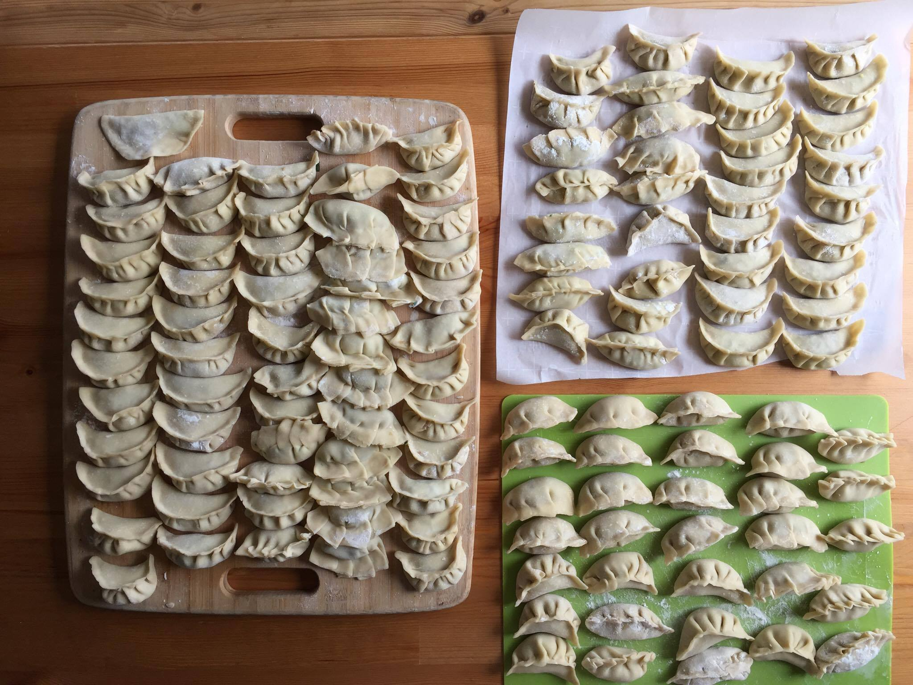
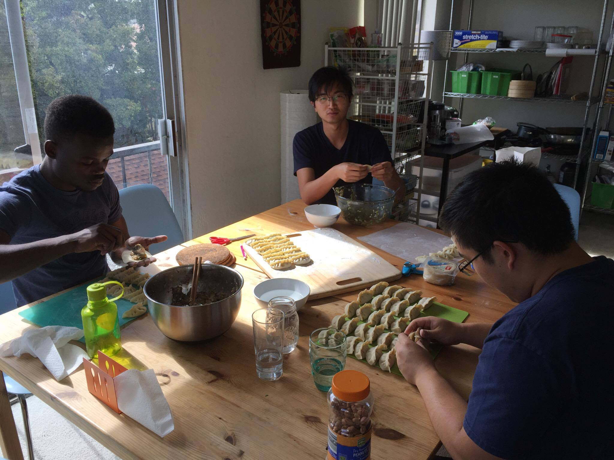

### Dumplings, Horchata, and Basketball

Here goes my first blog post… I don’t know where this is going to lead me or how much I’ll write, but the idea behind this is to just let my thoughts flow, so let’s get started.

Today, it seemed like everyone was just looking for a fight. Okay that’s an exaggeration but let me explain. It all started when I woke up and fought with William; over the most stupid thing ever too, alcohol. 

We’re throwing a kickback tomorrow night and he asked what alcohol we wanted him to get. Basically, he wanted expensive alcohol, I didn’t want expensive alcohol, and we just argued over why or why not we should spend the extra money. He seemed like he really wanted to splurge, and it wasn’t a big deal to me so I just went with it. We ended up making up since he got Ciroc (my drink of choice), or at least I took that gesture as his version of an olive branch. That was fight #1.

Next I headed to Berkeley to make dumplings with Denis, Keming, Roy, Duncan, and Vincent. This was definitely the highlight of the day. Dumplings turned out amazing, even though we burned some, and it was very relaxing sitting and folding dumplings (we made over 200 between the five of us). I think I ate over 40 of those things. 

 | 

Duncan and Vincent also brought out their homemade horchata for us to drink while we worked, which were as good as the ones from Taco Sinaloa. We wanted to go play basketball later and needed to digest, so we played some card games while we enjoyed the horchata.

The basketball courts were where all the interesting stuff happened. There was some type of fight or argument going on every game I played. Calls were argued almost every game, and one guy just wouldn’t stop yelling over me. I couldn’t even get a word in. Then another dude got mad at me for the dumbest thing. 

He called a timeout while he was on defense, while we had an open layup on the other end. 

Confused, I ask, “Why did we stop the ball.” 

“I thought there was a foul call.” (there was no foul)

“Oh, well you can’t just stop our fast break because you think there’s a foul call.”

Then he visibly gets mad at me for saying that, thinking that I was attacking him. I originally wanted the points from that fast break but decided to let it go. And the rest of the game just got chippy, with lots of fouls and all that other stuff.

We ended up winning the game, and I went up to him to shake his hand, common courtesy for pickup basketball. He walked away; I chased him down.

“Hey just wanted to say good game.”

Now he brings up the timeout thing from earlier and starts going off on me again, and he won’t shake my hand. 

What really gets to me is that there’s no reason for us not to be friendly, if not friends. One, we go to the same school, and there’s no reason for us to have this between us. Two, we both play basketball for fun. Three, he was wearing a golf shirt, and I really wanted to talk to him about golf after.

Told my parents about this, and parents really do always give good advice.

He was probably just having a bad day.

